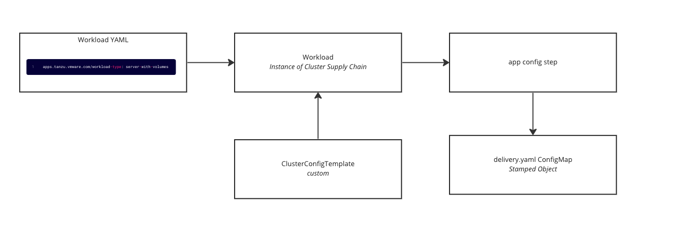

I was working with a customer the other day and some questions came up about how to support workloads that may vary from the ones that TAP supports out-of-the-box. Looking at [the docs](https://docs.vmware.com/en/VMware-Tanzu-Application-Platform/1.4/tap/workloads-workload-types.html) we can see that there are 3 types available to use today. This will support the majority of workloads that are commonly used, but what if another use case comes up and we need to quickly add support for deploying that workload on our existing TAP environment? This post will walk through the basic steps of adding a new workload type into TAP.

# How it works

First, let's break down what is meant by a "custom workload type". In TAP there is a resource called a "workload" which defines some minimal details about an application and abstracts away many of the underlying complexities of the infrastructure and the path that the app will take to get to a running state on that infrastructure i.e. the path to prod. The "workload" definition makes it easy for a developer to supply some basic app configuration and source code and get the app running on K8s with little to no knowledge of the underlying K8s environment. In the workload definition, there is a label that is used to set the type of workload that will be created. Based on that label's value, an instance of the supply chain is created for the workload and will generate a set of K8s resources that are determined by the type. For example the `server` type will generate a K8s `Deployment` and `Service` , while if the `web` type is specified it will generate a Knative Service. By creating a custom workload type we can define which K8s resources get generated when that type is specified.

TAP provides a way to include new workload types via a setting in the `values.yaml` called `ootb_supply_chain_basic.supported_workloads`, more on this in the implementation section below. What's great about this is that this makes it easy to add a custom workload type without having to modify any supply chains or do any real "customization" that strays from the OOTB offerings. In addition to the TAP values file modification, a new `ClusterConfigurationTemplate` needs to be added. The `ClusterConfigurationTemplate` is where the K8s resources that will be generated for the type are defined.

Here is a high-level outline of the end-to-end process:

1. A workload is defined with the custom workload type as the value for the label.
    
2. The workload is applied to the build cluster which instantiates an instance of the supply chain.
    
3. When the supply chain instance is created there is a selection that happens on the `app-config` step that looks at the workload type label and chooses the correct `ClusterConfigurationTemplate` , which in this case would be the custom one.
    
4. The supply chain eventually reaches the `app-config` step and the custom template stamps out a `ConfigMap` with the custom-defined K8s resources that will be eventually deployed on the TAP run clusters.
    

**Diagram of this flow:**



# The use case

As mentioned in the introduction we will be creating a new workload type for a use case that isn't currently covered by the out-of-the-box types. For this use case, we have an app that needs to mount a volume. Specifically, this app needs to mount a K8s persistent volume to store some data.

# Implementation

## Create a new Cluster Configuration Template

The `ClusterConfigurationTemplate` resource is used to define the resulting delivery YAML. This YAML will consist of the Kubernetes manifests that are responsible for running the application.

Apply the below YAML into the TAP build cluster.

```yaml
apiVersion: carto.run/v1alpha1
kind: ClusterConfigTemplate
metadata:
  annotations:
    doc: |
      This template consumes an input named config which contains a
      PodTemplateSpec and returns a ConfigMap which contains a
      "delivery.yml" which contains a manifests for a Kubernetes
      Deployment which will run the templated pod, and a "service.yml"
      Kubernetes Service to expose the pods on the network. This also supports 
      a workload param that allows for adding volumes
  name: volumes-template
spec:
  configPath: .data
  healthRule:
    alwaysHealthy: {}
  params:
  - default:
    - containerPort: 8080
      name: http
      port: 8080
    name: ports
  ytt: |
    #@ load("@ytt:data", "data")
    #@ load("@ytt:yaml", "yaml")
    #@ load("@ytt:struct","struct")
    #@ load("@ytt:assert", "assert")
    #@ load("@ytt:overlay", "overlay")

    #@ def merge_labels(fixed_values):
    #@   labels = {}
    #@   if hasattr(data.values.workload.metadata, "labels"):
    #@    labels.update(data.values.workload.metadata.labels)
    #@   end
    #@   labels.update(fixed_values)
    #@  return labels
    #@ end

    #@ def intOrString(v):
    #@   return v if type(v) == "int" else int(v.strip()) if v.strip().isdigit() else v
    #@ end

    #@ def merge_ports(ports_spec,containers):
    #@   ports = {}
    #@   for c in containers:
    #@     for p in getattr(c,"ports", []):
    #@       ports[p.containerPort] = {"targetPort": p.containerPort,"port": p.containerPort, "name": getattr(p, "name", str(p.containerPort))}
    #@     end
    #@   end
    #@   for p in ports_spec:
    #@     targetPort = getattr(p,"containerPort", p.port)
    #@     type(targetPort) in ("string", "int") or fail("containerPort must be a string or int")
    #@     targetPort = intOrString(targetPort)
    #@    
    #@     port = p.port
    #@     type(port) in ("string", "int") or fail("port must be a string or int")
    #@     port = int(port)
    #@     ports[p.port] = {"targetPort": targetPort, "port": port, "name": getattr(p, "name", str(p.port))}
    #@   end
    #@  return ports.values()
    #@ end

    #@ def addVolumes():
    spec:
      containers:
      #@overlay/match by="name"
      - name: workload
        #@overlay/match missing_ok=True
        volumeMounts: #@ data.values.params.volumes.volumeMounts
      #@overlay/match missing_ok=True
      volumes: #@ data.values.params.volumes.volumes

    #@ end

    #@ def delivery():
    ---
    apiVersion: apps/v1
    kind: Deployment
    metadata:
      name: #@ data.values.workload.metadata.name
      annotations:
      kapp.k14s.io/update-strategy: "fallback-on-replace"
      ootb.apps.tanzu.vmware.com/servicebinding-workload: "true"
      labels: #@ merge_labels({ "app.kubernetes.io/component": "run","carto.run/workload-name": data.values.workload.metadata.name })
    spec:
      selector:
        matchLabels: #@ data.values.config.metadata.labels
      template: #@ overlay.apply(data.values.config,addVolumes())
    ---
    apiVersion: v1
    kind: Service
    metadata:
      name: #@ data.values.workload.metadata.name
      labels: #@ merge_labels({ "app.kubernetes.io/component": "run", "carto.run/workload-name": data.values.workload.metadata.name })
    spec:
      selector: #@ data.values.config.metadata.labels
      ports:
      #@ hasattr(data.values.params, "ports") and len(data.values.params.ports) or assert.fail("one or more ports param must be provided.")
      #@ declared_ports = {}
      #@ if "ports" in data.values.params:
      #@   declared_ports = data.values.params.ports
      #@ else:
      #@   declared_ports = struct.encode([{ "containerPort": 8080, "port": 8080, "name": "http"}])
      #@ end
      #@ for p in merge_ports(declared_ports, data.values.config.spec.containers):
        - #@ p
      #@ end
    #@ end

    ---
    apiVersion: v1
    kind: ConfigMap
    metadata:
      name: #@ data.values.workload.metadata.name + "-server"
      labels: #@ merge_labels({ "app.kubernetes.io/component": "config"})
    data:
      delivery.yml: #@ yaml.encode(delivery())
```

Let's break this template down a bit.

1. The resource takes as input a `PodTemplateSpec` from the previous step in the supply chain. This is accessible through the `data.values.config` .
    
2. The resource defines a ytt template that will be used to generate a `ConfigMap` that holds the `delivery.yaml` . The `delivery.yaml` contains the Kubernetes manifests to run the app.
    
3. The `delivery()` function - Defines a templated K8s deployment and service using input from the workload params and the previous step's `PodTemplateSpec` .
    
4. The `addVolumes()` function - this is used within the delivery function to modify the incoming `PodTemplateSpec` , it will take the volume params provided in the workload spec and add them to the `PodTemplateSpec` . **This is the part that is doing most of the custom work to enable volumes.**
    
5. The `merge_ports()` function - this takes in any custom ports defined in the params in the workload spec and adds them to the service.
    
6. The `merge_labels()` function - this does a similar task to the merge\_ports but this time with any labels passed in.
    

## Update the TAP values to include the new workload type

To register this new workload type a new section needs to be added to the supply chain's configuration.

Edit the TAP values and add the below YAML. Notice this is being added to the `ootb_supply_chain_basic` section so just append this along with any other settings. After updating these settings, update the tap install using the Tanzu cli.

```yaml
ootb_supply_chain_basic:
  supported_workloads:
  - type: web
    cluster_config_template_name: config-template
  - type: server
     cluster_config_template_name: server-template
  - type: worker
    cluster_config_template_name: worker-template
  - type: server-with-volumes
    cluster_config_template_name: volumes-template
```

The settings above define four workload types, three of which are provided OOTB. The existing three need to be specified otherwise they will be removed. The fourth is the custom workload type that has been named `server-with-volumes` and is referencing the new `ClusterConfigurationTemplate` named `volumes-template` . These settings are what associate the workload type that will be used in the workload spec with the new template defined in the previous step.

## Create a workload using the new type

Keeping with the thread of our new use case, for this workload we need to mount a persistent volume. Creating the volume is out of the scope of this post, but any K8s PVC will work. In this case, the PVC is just using the AWS EBS CSI driver to create a disk.

Apply the below YAML into the TAP build cluster

```yaml
apiVersion: carto.run/v1alpha1
kind: Workload
metadata:
  labels:
    app.kubernetes.io/part-of: go-sample-pvc
    apps.tanzu.vmware.com/workload-type: server-with-volumes
  name: go-sample-pvc
  namespace: default
spec:
  params:
    - name: volumes
      value:
        volumes:
        - name: data-mount
          persistentVolumeClaim:
            claimName: go-sample-data
        volumeMounts:
         - name: data-mount
           mountPath: /sample-data
  source:
    git:
      ref:
        branch: main
      url: https://github.com/warroyo/tap-go-sample
```

The main things to point out in the above YAML are the following:

1. `apps.tanzu.vmware.com/workload-type: server-with-volumes` this label is what is used for selecting the workload type. Notice that the `server-with-volumes` name matches the one we added to the TAP values.
    
2. The `volumes` param - This is where the volumes and volume mounts are defined. To keep it simple and flexible the format of these parameters is just using the same spec from the K8s pod spec for defining volumes. This means anything that can be done through [these docs](https://kubernetes.io/docs/concepts/storage/volumes/), can be added here.
    

After deploying this workload the resulting K8s manifests will look like this. Notice that the volume and volume mounts have been added to the pod spec.

```yaml
apiVersion: apps/v1
kind: Deployment
metadata:
  name: go-sample-pvc
  annotations: null
  kapp.k14s.io/update-strategy: fallback-on-replace
  ootb.apps.tanzu.vmware.com/servicebinding-workload: "true"
  labels:
    app.kubernetes.io/part-of: go-sample-pvc
    apps.tanzu.vmware.com/has-tests: "true"
    apps.tanzu.vmware.com/workload-type: server-with-volumes
    app.kubernetes.io/component: run
    carto.run/workload-name: go-sample-pvc
spec:
  selector:
    matchLabels:
      app.kubernetes.io/component: run
      app.kubernetes.io/part-of: go-sample-pvc
      apps.tanzu.vmware.com/has-tests: "true"
      apps.tanzu.vmware.com/workload-type: server-with-volumes
      carto.run/workload-name: go-sample-pvc
  template:
    metadata:
      annotations:
        conventions.carto.run/applied-conventions: |-
          spring-boot-convention/auto-configure-actuators-check
          spring-boot-convention/app-live-view-appflavour-check
          appliveview-sample/app-live-view-appflavour-check
        developer.conventions/target-containers: workload
      labels:
        app.kubernetes.io/component: run
        app.kubernetes.io/part-of: go-sample-pvc
        apps.tanzu.vmware.com/has-tests: "true"
        apps.tanzu.vmware.com/workload-type: server-with-volumes
        carto.run/workload-name: go-sample-pvc
    spec:
      containers:
      - image: dev.registry.pivotal.io/warroyo/go-sample-pvc-default@sha256:94eec8cb112d4e860ab6cc9095f40db0779889f7ee0a953f0876d4b4b29ef0ce
        name: workload
        resources: {}
        securityContext:
          runAsUser: 1000
        volumeMounts:
        - mountPath: /sample-data
          name: data-mount
      serviceAccountName: default
      volumes:
      - name: data-mount
        persistentVolumeClaim:
          claimName: go-sample-data
---
apiVersion: v1
kind: Service
metadata:
  name: go-sample-pvc
  labels:
    app.kubernetes.io/part-of: go-sample-pvc
    apps.tanzu.vmware.com/has-tests: "true"
    apps.tanzu.vmware.com/workload-type: server-with-volumes
    app.kubernetes.io/component: run
    carto.run/workload-name: go-sample-pvc
spec:
  selector:
    app.kubernetes.io/component: run
    app.kubernetes.io/part-of: go-sample-pvc
    apps.tanzu.vmware.com/has-tests: "true"
    apps.tanzu.vmware.com/workload-type: server-with-volumes
    carto.run/workload-name: go-sample-pvc
  ports:
  - targetPort: 8080
    port: 8080
    name: http
```

# Summary

In summary, the steps in this post walked through adding a new configuration template that takes parameters from the workload spec and uses those to inject volumes into the resulting pods. We then associated that new configuration template with a new workload type that can be used by a developer when creating a workload. This approach could be used for many other use cases and is not limited to adding volumes. Hopefully, this shows how TAP can be extended to support all kinds of different workloads and application needs while also providing a good user experience for the developer.
