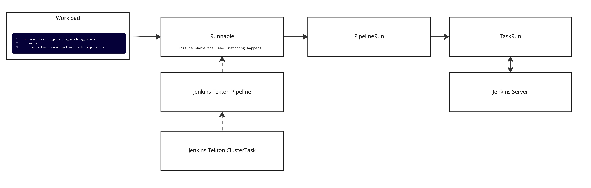
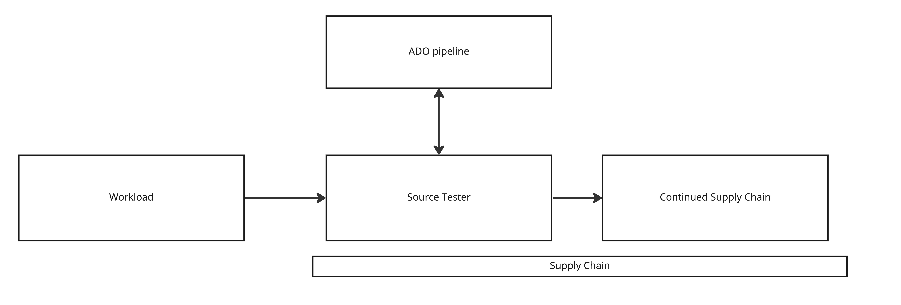

TAP has an OOTB source code testing capability that makes use of [Tekton pipelines](https://tekton.dev/docs/pipelines/pipelines/) to execute tests based on your workload types. However, many organizations have already implemented their testing processes in another tool like Jenkins or Azure DevOps (ADO). As of TAP 1.3, you can [natively use Jenkins](https://docs.vmware.com/en/VMware-Tanzu-Application-Platform/1.3/tap/GUID-scc-ootb-supply-chain-testing-with-jenkins.html?hWord=N4IghgNiBcIFYFMB2BrAlkgziAvkA) for your source testing in the TAP supply chain. In talking with several customers and co-workers it was apparent that integrating with ADO would be very useful. In this post, we will walk through the steps to get the TAP source code testing capability working with Azure DevOps pipelines.

## How it works

Since TAP already has an integration with Jenkins, we will follow a similar pattern for implementing the ADO integration. Below is a breakdown of how source testing works in TAP with Jenkins. The diagram shows that there is a parameter for `testing_pipeline_matching_labels` in the workload definition, this is what is used to select the pipeline, via label selectors, that should be used for testing. From there a `Runnable` is created and uses the label selectors to associate the Jenkins Tekton pipeline. There is also a `ClusterTask` that the pipeline references; this is where the code exists for communicating with Jenkins. From there, when the supply chain executes it will create a `PipelineRun` with the parameters from the workload that will spawn a `TaskRun`.The task run executes the Jenkins job and returns the results. There are a few pieces I left out of the diagram to make it easier to follow but, overall this covers most of what happens.



Based on the above flow, there will be two things needed to implement an ADO equivalent: a custom `ClusterTask` and a `Pipeline`. With those defined, we will be able to use native TAP functionality to selectively run tests in ADO. These two resources are core components of Tekton, you can find the docs on them [here](https://tekton.dev/docs/pipelines/pipelines/).

## Implementation

### Create a simple pipeline in ADO

Login to ADO and create a "new project" or use an existing project that you may have. If you are using the Azure CLI, run the below command.

```bash
az devops project create --name tap-ado-blog --org https://dev.azure.com/<your-organization>
```

After creating the new project there will also be a default repo created by the same name, e.g. `tap-ado-blog`. This is the repo that will be used for the pipeline in the next step. You can also create a new repo or use an existing one, just be sure to change the names in the next steps accordingly.

The below YAML will be used for the newly created pipeline. This sets up three parameters, two of which are required since the TAP supply chain passes the `source_url` and `source_revision` by default. The third is an optional parameter that shows how to pass additional parameters to the ADO pipeline in the workload YAML. The pipeline steps can be customized to handle any testing scenario needed.

```yaml
trigger:
- none

pr: none 

pool:
  vmImage: ubuntu-latest

parameters:
  - name: source_url
    displayName: source url to clone
    type: string
  - name: source_revision
    displayName: revision to clone
    type: string
  - name: example_param
    displayName: example
    default: ""
    type: string
    
steps:
- script: echo ${{parameters.source_url}} "succesfully triggered this build from TAP"
- script: echo ${{parameters.source_revision}} "succesfully triggered this build from TAP"
```

Next, create a new pipeline...

**From the UI:** make the following selections `Pipelines->Create pipeline->Azure Repos Git->tap-ado-blog->Starter Pipeline`. Add the above YAML after selecting the "Starter Pipeline" and save it.

**Using the CLI:** commit the above YAML to the newly created repo as `azure-pipelines.yml` , run the below commands.

```bash
git clone https://<your-org>@dev.azure.com/<your-org>/tap-ado-blog/_git/tap-ado-blog 
cd tap-ado-blog
touch azure-pipelines.yml
#paste the contents from the above yaml into the new file
git add .
git commit -am "adding pipelines"
git push

az pipelines create --name 'tap-ado-blog' --description 'Pipeline for TAP' --repository tap-ado-blog  --branch main --repository-type tfsgit --org https://dev.azure.com/<your-organization> --project tap-ado-blog --yaml-path azure-pipelines.yml
```

### Create a PAT in Azure DevOps

To execute the pipeline from TAP there needs to be a PAT created to auth against the API. If you are running TAP in Azure you could do something like role-based access control to provide auth but that is for another blog post.

**From the UI:** select `Upper right settings->Personal Access Tokens->New Token->Full Access` , see [here](https://learn.microsoft.com/en-us/azure/devops/organizations/accounts/use-personal-access-tokens-to-authenticate?view=azure-devops&tabs=Windows) for the full docs.

**Using the CLI:** as of 12/28/2022, there is no way to get a PAT from the CLI except for going direct to the REST API.

Save the generated PAT for later use.

### Relocate the required image to your registry

In the docs for TAP it will typically have you relocate your images to a registry during the installation. The new `ClusterTask` that will be created for this ADO integration will require a new image due to its Python dependency. Run the following command after exporting the required variables to relocate the image to your registry.

```bash
imgpkg copy -i python:3.7-slim --to-repo ${INSTALL_REGISTRY_HOSTNAME}/${INSTALL_REPO}/tap-packages
```

After running the command you will see some output similar to

```bash
will export index.docker.io/library/python@sha256:aa949f5f10e9b28e1f9561fff73d1a359fa8517d4e543451a714d1a4ecc61c56
```

To get the full path to the copied image, copy everything starting with the `@` symbol in your output and append it to the new repo path. The resulting full image path will look something like

```bash
${INSTALL_REGISTRY_HOSTNAME}/${INSTALL_REPO}/tap-packages@sha256:aa949f5f10e9b28e1f9561fff73d1a359fa8517d4e543451a714d1a4ecc61c56

# for example: https://dev.registry.pivotal.io/warroyo/tap-packages@sha256:aa949f5f10e9b28e1f9561fff73d1a359fa8517d4e543451a714d1a4ecc61c56
```

Depending on when you run this the SHA may be different, but the same process applies to get the full path to the image.

### Create the TAP resources

**NOTE:** The next few steps will walk you through creating the required TAP resources. This should be done in the "build" cluster, or if you are using a "full profile", it will be in the single cluster since the build components are colocated. Ensure you are in the correct context when running these commands.

Create a Kubernetes secret to store the PAT from the previous section. This should be done in the "developer namespace".

```bash
kubectl -n <developer-ns> create secret generic ado-token --from-literal=pat=<your-pat-here>
```

Create a new `ClusterTask`, this will set up the code that will be executed to run the pipeline in Azure. In the Below YAML, replace `<your-relocated-image-here>` with the image from the above step. After modifying, apply this to the cluster with `kubectl`.

```yaml
apiVersion: tekton.dev/v1beta1
kind: ClusterTask
metadata:
  name: ado-task
spec:
  params:
  - name: source-url
    type: string
  - name: source-revision
    type: string
  - name: secret-name
    type: string
  - name: pipeline-id
    type: string
  - name: project-name
    type: string
  - name: org-name
    type: string
  - default: ""
    name: pipeline-params
    type: string
  results:
  - name: ado-pipeline-run-url
    type: string
  steps:
  - name: install-depends
    image:  <your-relocated-image-here>
    script: |
      pip install requests
  - env:
    - name: ADO_API_TOKEN
      valueFrom:
        secretKeyRef:
          key: pat
          name: $(params.secret-name)
    - name: SOURCE_URL
      value: $(params.source-url)
    - name: PIPELINE_PARAMS
      value: $(params.pipeline-params)
    - name: SOURCE_REVISION
      value: $(params.source-revision)
    - name: PIPELINE_ID
      value: $(params.pipeline-id)
    - name: ORG_NAME
      value: $(params.org-name)
    - name: PROJECT_NAME
      value: $(params.project-name)
    image:  <your-relocated-image-here>
    name: trigger-ado-build
    script: |
      #!/usr/bin/env bash
      set -o errexit
      set -o pipefail
      pip install requests

      python3 << END
      import os
      import subprocess
      import logging
      import sys
      import time
      import json
      import requests


      logging.basicConfig(level=logging.DEBUG)

      org = os.getenv('ORG_NAME')
      project = os.getenv('PROJECT_NAME')
      pipeline = os.getenv('PIPELINE_ID')
      token = os.getenv('ADO_API_TOKEN')
      source_url = os.getenv('SOURCE_URL')
      source_revision = os.getenv('SOURCE_REVISION')
      pipeline_params = os.getenv('PIPELINE_PARAMS')

      url = f'https://dev.azure.com/{org}/{project}/_apis/pipelines/{pipeline}/runs?api-version=7.0'
      existing_params = {
          "source_url": f'{source_url}',
          "source_revision": f'{source_revision}'
      }

      input_params = {}
      if pipeline_params != "":
        input_params = json.loads(pipeline_params)

      existing_params.update(input_params)
      payload = json.dumps({
      "templateParameters": existing_params
      })

      headers = {
      'Content-Type': 'application/json'
      }

      pipelineResponse = requests.request("POST", url, headers=headers, data=payload,auth=('',token)) 
      logging.info(pipelineResponse.text)
      #throw error if not 200
      pipelineResponse.raise_for_status()

      #check status of pipeline run and validate it succeeds

      jsonResponse = pipelineResponse.json()

      currentRun = jsonResponse['_links']['self']['href']
      results_url = jsonResponse['_links']['web']['href']
      f = open("$(results.ado-pipeline-run-url.path)", "w")
      f.write(results_url)
      f.close()


      running = True
      while running:
        response = requests.get(currentRun, headers=headers, auth=('',token), timeout=300)
        response.raise_for_status()
        result = response.json()
        if result['state'] != 'completed':
          logging.info(f"pipeline state is {result['state']}, entering sleep for 5 seconds")
          time.sleep(5)
        elif result['result'] == 'succeeded':
          logging.info(f"pipeline was successful, exiting")
          sys.exit(os.EX_OK)
        else:
          logging.info(f"pipeline result is {result['result']}, check ADO")
          sys.exit(os.EX_SOFTWARE)
      END
```

As you will notice, the main portion of the above file is a script. I chose Python for this since it was much easier to read than the Bash equivalent. Taking a deeper look into what is happening in the script we see the following:

* parameters are being passed in from the supply chain
    
* a REST call is made to ADO to execute the pipeline
    
* a while loop is used to continuously execute a REST call to ADO until the status is `succeeded` or `failed`
    

Next create a new `Pipeline` that will reference the `ClusterTask` and have the required labels so that it can be selected by the supply chain. This should also be created in the "developer namespace".

```yaml
---
apiVersion: tekton.dev/v1beta1
kind: Pipeline
metadata:
  name: developer-defined-ado-pipeline
  namespace: <developer-ns>
  labels:
    #! This label should be provided to the Workload so that
    #! the supply chain can find this pipeline
    apps.tanzu.vmware.com/pipeline: ado-pipeline
spec:
  results:
  - name: ado-pipeline-run-url   #! To show the job URL on the
    #! Tanzu Application Platform GUI
    value: $(tasks.ado-task.results.ado-pipeline-run-url)
  params:
  - name: source-url        #! Required
  - name: source-revision   #! Required
  - name: secret-name       #! Required
  - name: project-name       #! Required
  - name: pipeline-id       #! Required
  - name: org-name           #! Required
  - name: pipeline-params
    default: ""
  tasks:
  - name: ado-task
    taskRef:
      name: ado-task
      kind: ClusterTask
    params:
      - name: source-url
        value: $(params.source-url)
      - name: source-revision
        value: $(params.source-revision)
      - name: secret-name
        value: $(params.secret-name)
      - name: pipeline-id
        value: $(params.pipeline-id)
      - name: org-name
        value: $(params.org-name)
      - name: project-name
        value: $(params.project-name)
      - name: pipeline-params
        value: $(params.pipeline-params)
```

Finally, create or modify a workload to use the new labels and parameters that will trigger the ADO testing pipeline. The below workload can be used since the GitHub repo is public and can be cloned without credentials. Just replace the `org-name` and `pipeline-id` with the ones from your account. The `pipeline-id` can be found in the URL when looking at the pipeline in the browser.

```yaml
---
apiVersion: carto.run/v1alpha1
kind: Workload
metadata:
  labels:
    app.kubernetes.io/part-of: company-api-ado
    apps.tanzu.vmware.com/has-tests: "true"
    apps.tanzu.vmware.com/workload-type: web
  name: company-api-ado
  namespace: default
spec:
  build:
    env:
      - name: BP_KEEP_FILES
        value: "docs/*"
  source:
    git:
      ref:
        branch: main
      url: https://github.com/warroyo/tap-go-sample
  params:
    - name: testing_pipeline_matching_labels
      value:
        apps.tanzu.vmware.com/pipeline: ado-pipeline
    - name: testing_pipeline_params
      value:
        project-name: tap-ado-blog
        secret-name: ado-token
        org-name: <your-org>
        pipeline-id: <pipeline-id> 
        pipeline-params: "{\"newparam\": \"testing\"}"
```

Once this workload is created the `source-tester` step should now execute the pipeline in ADO.

### Final Result

The final result is illustrated in the diagram below. The workload creates a supply chain and as part of that the `source-tester` step is executed. The `source-tester` triggers the ADO pipeline defined in the workload and will either fail and stop the supply chain or succeeded and continue the supply chain.



## Conclusion

In summary, the steps in this blog added an option to our TAP supply chain to use ADO pipelines for testing code. One really nice thing about this is that it didn't require any modifications to the supply chains or any core TAP components. Through the native label selection that TAP provides we were able to add another testing option in addition to the OOTB options. This also does not need to be limited to testing code in the ADO pipeline. In a future post, I will cover how the same approach could be used to add steps to the supply chain that will run some arbitrary steps in an ADO Pipeline. This should give an idea of the possibilities that exist for integrating TAP with other toolsets.
