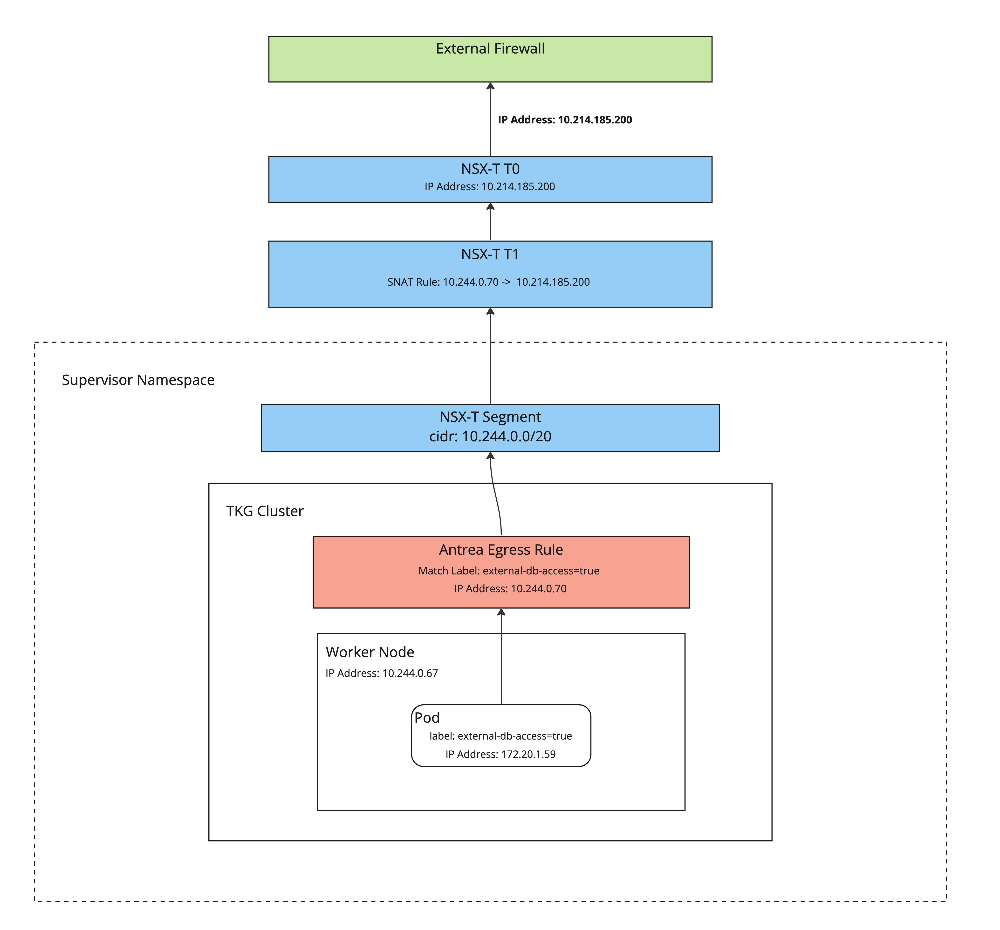
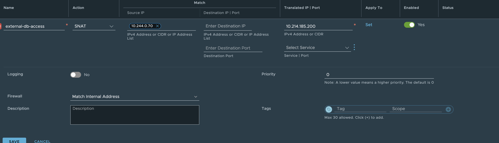

A question comes up often of how can a static IP be set for workloads running in TKG. The answer is generally "It depends" and then followed by a series of questions about why it's needed and if there are alternatives that could be done etc. In many scenarios, this is needed so that workloads running in a container on TKG can be identified by an external firewall and be allowed to talk to some external service. For example, maybe a workload needs to get access to a particular database and it has a strict access policy based on IP.

The overall solution depends on what the full networking stack is that you are using with TKG, but a common challenge is doing this when you are using TKG with supervisor(TKGs) that is backed by NSX-T. The issue is that when using this architecture, all traffic that comes out of a supervisor namespace is routed through a namespace-specific T1 and has a SNAT rule that maps it to a single IP address. This means that all workloads in a supervisor namespace appear as the same IP to the external network.

In this article, we will walk through a solution to the problem mentioned above so that we can associate different external IPs with specific workloads running in TKG clusters.

## The solution

To solve this problem we will use a combination of Antrea and NSX-T. Ultimately we need to be able to make sure that when a container in a pod makes a request, eventually it is associated with a specific IP on the physical network. We also want to potentially have pods in the same cluster that have different external-facing IPs on the network. To do this we can use Antrea egress policies and custom NSX-T SNAT rules.

**Antrea egress policy**: This allows us to specify a static IP or pool of IPs that traffic will be SNAT'd to when leaving the node if it matches a specific set of labels. You can read all the details [here](https://antrea.io/docs/v1.13.1/docs/egress/).

**NSX-T SNAT rules:** This allows us to specify a rule that matches an IP or range of IPs and translates it to an IP on the physical network as it exits the T0.

We can now combine the two features above to solve the problem. The way this works is that the Antrea egress policy will handle making sure that the traffic leaving the node for a specific pod(s) will be a specific IP address, rather than the node's IP address. We can then use the NSX-T SNAT rule to ensure that the IP we specified in the Antrea egress rule is translated to the right external facing IP address. This means that we now have a way to label a pod and have it result in a specific IP address on the physical network.

This diagram shows a simplified flow of the IP translations.



## Implementation

This will assume that the following prereqs are met before implementing the solution.

* TKG w/supervisor deployed
    
* TKG w/supervisor backed my NSX-T
    
* A TKG workload cluster deployed
    
* Antrea as a CNI
    

### Create the egress policy

The first step is to create the Antrea egress policy and IP pool. This will be where the label matching is set so that we can target specific pods or namespaces in the cluster.

create the following YAML file and apply it to your workload cluster.

```yaml
apiVersion: crd.antrea.io/v1alpha2
kind: Egress
metadata:
  name: egress-external-db
spec:
  appliedTo:
    podSelector:
      matchLabels:
        external-db-access: 'true'
  externalIPPool: external-ip-pool
---
apiVersion: crd.antrea.io/v1alpha2
kind: ExternalIPPool
metadata:
  name: external-ip-pool
spec:
  ipRanges:
  - start: 10.244.0.70  # IP from segment that nodes are on
    end: 10.244.0.70
  nodeSelector: {}     # All Nodes can be Egress Nodes
```

After applying the file you should see a status like this:

```bash
 k get egresses.crd.antrea.io egress-external-db
NAME                 EGRESSIP      AGE   NODE
egress-external-db   10.244.0.70   18s   tes-snat-1-md-0-bzfm4-7678dc8766-w7rz2
```

In the above file, you can see that we are creating two resources. the `Egress` resource defines the match criteria and the IP pool we will use. The `ExternalIPPool` defines the IP range that we want to use. In this case, it's set to just 1 IP. This IP is pulled from the cluster's segment CIDR in NSX-T, so it is an IP that would typically be used for a node. This IP could be from another range but for simplicity, we are using the segment's CIDR.

### Create a workload with matching labels

We now need to create a workload that matches our egress policy label selectors. This will start up a pod that matches the labels, in this example, we are using [netshoot](https://github.com/nicolaka/netshoot) which is an open-source tool for network troubleshooting.

Apply the following YAML into the workload cluster.

```yaml
apiVersion: apps/v1
kind: Deployment
metadata:
    name: netshoot
    labels:
        app: netshoot
spec:
    replicas: 1
    selector:
        matchLabels:
            app: netshoot
    template:
        metadata:
          labels:
            app: netshoot
            external-db-access: 'true'
        spec:
            containers:
            - name: netshoot
              image: nicolaka/netshoot
              command: ["/bin/bash"]
              args: ["-c", "while true; do ping localhost; sleep 60;done"]
```

At this point, the traffic leaving this pod will be translated to our Antrea egress IP `10.244.0.70` . However we are not finished just yet, the IP at this point will still be translated to the default NSX-T egress IP when leaving the T0 because our default SNAT rule that is created by TKG is capturing all traffic on that segment's subnet.

### Add the custom NSX-T SNAT rule

This is where we will create a rule in NSX-T to translate the Antrea egress IP to the final outbound IP address. This can be done either through the UI or automation with the API, etc. For simplicity, this shows how to create the rule in the UI.

1. go into the NSX-T console and navigate to the Networking-&gt;NAT section.
    
2. find the T1 that is associated with your supervisor namespace in the dropdown. the T1 name will contain the ns name.
    
3. create a new SNAT rule, see the image below for details. This will set the Antrea egress IP as the source and the destination is the outbound IP we want from the NSX-T egress range.
    
    
    
    We can now test to see if the IP is being translated properly.
    

### Validate it

To validate this we will exec into the container and ping a Linux box running on a different network while watching traffic with `tcpdump`. This will make the traffic flow the full course of the network and we should see the outbound translated IP.

Run the ping command to the Linux box on `10.220.13.144`

```bash
k exec -it netshoot-75dd7f67c9-zck8f -- bash
netshoot-75dd7f67c9-zck8f: ping
netshoot-75dd7f67c9-zck8f: ping 10.220.13.144 
PING 10.220.13.144 (10.220.13.144) 56(84) bytes of data.
```

Check the tcpdump on the Linux box. Notice the IP is `10.214.185.200` which is our custom SNAT rule IP.

```bash
tcpdump -i eth0 icmp
tcpdump: verbose output suppressed, use -v[v]... for full protocol decode
listening on eth0, link-type EN10MB (Ethernet), snapshot length 262144 bytes
17:16:23.009148 IP 10.214.185.200 > photon-machine: ICMP echo request, id 2823, seq 1, length 64
```

## Summary

In summary, using this approach will allow you to be able to conform to existing firewall rules and policies that rely on specifying an IP address for specific workloads. This could be used for many different use cases that require this type of granularity. additionally it lets us use a labeling and code-based mechanism to assign these IPs to workloads and can be very dynamic if needed.
