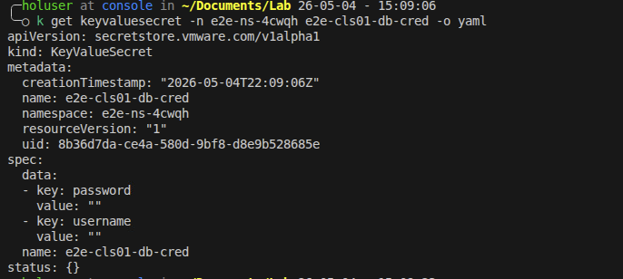
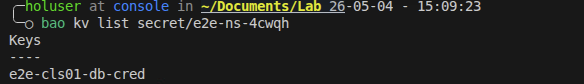
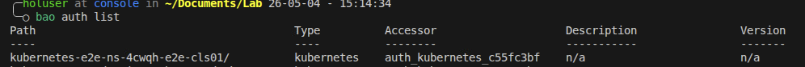
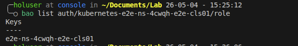
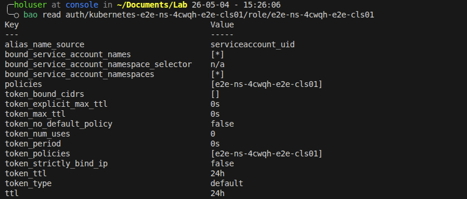
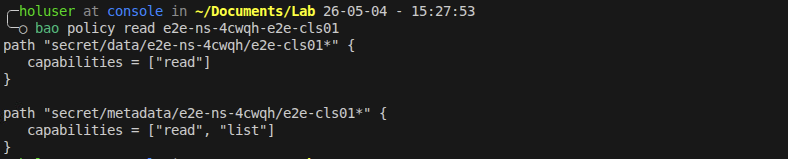
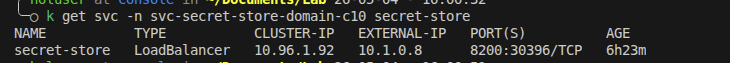
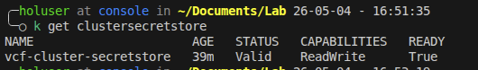
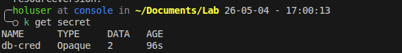

If you haven't heard of the [VCF Secret Store Service](https://techdocs.broadcom.com/us/en/vmware-cis/vcf/vsphere-supervisor-services-and-standalone-components/latest/using-supervisor-services/using-secret-store-service-with-vsphere-supervisor.html) I highly recommend taking a look. This is a supervisor service that behind the scenes deploys [OpenBao](https://openbao.org/). however it's not just deploying OpenBao, it provides deep integration with VKS, VMs and vSphere Pods. I am not going to outline every feature here, but it's specifically built to make it easier to store and retrieve secrets in a VCF environment securely and seamlessly. This post is going to be dedicated to walking through using the Secret Store with External Secrets Operator(ESO).

As a pre-requisite to this you need to deploy the service, the docs [here](https://techdocs.broadcom.com/us/en/vmware-cis/vcf/vsphere-supervisor-services-and-standalone-components/latest/using-supervisor-services/using-secret-store-service-with-vsphere-supervisor/install-and-configure-secret-store-as-a-supervisor-service.html) can help out with that. For these specific features you will want to deploy version `9.1.0+25367485` , which you can find linked on the docs or directly [here](https://packages.broadcom.com/artifactory/vsphere-distro/vsphere/iaas/secret-store/). Once the service is running it will automatically handle a lot of the heavy lifting for us. Specifically the there will be two features that we take advantage of here.

1.  `KeyValueSecret` API - when creating a secret using the Secret Store's api(KeyValueSecret) we can have it automatically place the secret into a OpenBao key value mount that will be cluster scoped or supervisor namespace scoped. The secret store service handles the roles and policies required to do this so a user only needs access to the `KeyValueSecret` api in a namespace. It's also important to know that this API does not store the secret in ETCD, this is passed through directly to OpenBao.
    
2.  Automated k8s auth - the secret store service will automatically create a k8s auth mount for each cluster created, it will also set up a role and policy that allows service accounts in that VKS cluster to access the cluster scoped KV path.
    

Between these two features it will reduce the toil for a developer or platform engineer when accessing secrets in their clusters. Typically setting this up without Secret Store would require direct access to the OpenBao API in order to write secrets along with roles etc. that were setup by the admin to allow users this access. Then for access from the cluster this would require an OpenBao admin to create a k8s auth mount point in OpenBao for every cluster with roles, policy, and have access to the k8s cluster details in order to properly setup that auth endpoint. By automating this process with Secret Store it provides immediate access for users in a supervisor namespace to create secrets without having to have roles manually created and completely removes the manual work that an OpenBao admin would need to do in order to setup k8s auth on the clusters.

**Throughout this post I will be showing what the results look like using the** `bao` **cli this is not a requirement for using the Secret Store Service, this is just for educational purposes.**

## Setup

### Pre-reqs

*   The Secret Store Supervisor Service Deployed
    
*   A Supervisor namespace
    
*   A VKS cluster created in the namespace
    

### Creating a secret

In this example we will create a simple secret in the namespace `e2e-ns-4cwqh` this is going to be a cluster scoped secret. To create a cluster scoped secret simply prefix the secret name with the cluster name. In this case the cluster name is `e2e-cls01` , so we will create a secret called `e2e-cls01-db-cred` . The policy and role that are automatically created when the cluster is created will be set only only allow reads from secrets with this cluster naming convention(more on this later).

Add the following yaml to a file called `keyvaluesecret.yaml` and apply it into the namespace

```yaml
kind: KeyValueSecret
apiVersion: secretstore.vmware.com/v1alpha1
metadata:
  name: e2e-cls01-db-cred
spec:
  name: e2e-cls01-db-cred
  data:
    - key: username
      value: admin
    - key: password
      value: secretadminpass
```

```shell
 kubectl apply -f keyvaluesecret.yaml -n e2e-ns-4cwqh
```

We can see the secret was created from both the namespace view and the underlying OpenBao view. Notice that the secret store API does not return the secret values by design and for security reasons.

kubectl output:



and the bao CLI output:



At this point our secret is created and cluster scoped. Let's take a look at the policies that were auto created for the cluster and namespace.

### Reviewing the Policies

As mentioned before one of the big benefits of the Secret Store Service is that it automatically handles auth, roles, and policies for namespaces and clusters. let's use the `bao` cli to take a look at what has been created for the cluster scoped access. This step is not necessary when using the service, it's purely educational

Here is the k8s auth endpoint that was automatically generated for our cluster.



We can then see what role was associated with this new auth endpoint.



Now let's look at the role and see what Policy it's associated with. This also shows what K8s service accounts can be used with this in the VKS cluster.



And now we can look at the policy and see what it allows. This shows that it has read capability on the namespace path for anything starting with the cluster name.



After looking at all of this it validates that Secret Store Service created everything we need to be able to access the cluster scoped secrets in our secret store.

### Deploy External Secret Operator

As of writing this there is not an official ESO package for VKS, but that's ok we can use the ESO helm chart without any issues because of course VKS clusters are conformant K8s clusters.

Prior to deploying let's collect some info, we need to get our Secret Store Service endpoint, this can be found by running the below command in the supervisor namespace context. You can see in the output that we have an external IP, that is what we are going to connect to on `https` and port `8200`.



We also will want the CA certificate for the service, we will need it in base64 format so no need to decode it. You can get it with this command. Save both of these details for later.

```shell
kubectl get secret server-cert -n svc-secret-store-domain-c10 -o jsonpath='{.data.ca\.crt}'
```

Now to deploy ESO, connect to your VKS cluster context and deploy ESO using the [provided helm instructions](https://external-secrets.io/latest/introduction/getting-started/#installing-with-helm). The only addition we will make is to add a host alias for the secret store service, this way we can easily trust the cert later on. Use this for the values file:

```yaml
global:
  hostAliases:
  - ip: "10.1.0.8" # replace this with your external IP
    hostnames:
    - "secret-store"
```

### Create the service account

In order to connect back to the secret store service we need a service account in the VKS cluster. This service account will also need a specific cluster role for "auth-delegator" create a file called `sa.yml` and paste the below yaml into it. This will handle creating the service account and the role binding that is needed.

```yaml
# service account
apiVersion: v1
kind: ServiceAccount
metadata:
  name: secret-store-access
  namespace: external-secrets
---
# Cluster role binding
apiVersion: rbac.authorization.k8s.io/v1
kind: ClusterRoleBinding
metadata:
  name: ss-auth-binding
roleRef:
  apiGroup: rbac.authorization.k8s.io
  kind: ClusterRole
  name: system:auth-delegator
subjects:
  - kind: ServiceAccount
    name: secret-store-access
    namespace: external-secrets
```

Now apply this into the VKS cluster.

```shell
$ kubectl apply -f sa.yaml
```

At this point the service account in the cluster should have access to the cluster scoped secrets in the Secret Store. The last steps are to create the ESO components to fetch the secret.

### Create the ESO resources

The `ClusterSecretStore` is a cluster level resource that is going to connect ESO to our Secret Store Service OpenBao instance. This is where the service account comes in. Create a file called `css.yaml` and put the below yaml into it. Even if the user creating this does not have access to directly look up roles and auth, which they likely won't, these are just templated names that can be derived easily. The `mountPath` is always `kubernetes-<supervisor_ns>-<cluster_name>` and the `role` is always `<supervisor_ns>-<cluster_name>` .

```yaml
apiVersion: external-secrets.io/v1
kind: ClusterSecretStore
metadata:
  name: vcf-cluster-store
spec:
  provider:
    vault:
      server: "https://secret-store:8200"
      caBundle: "<base64 bundle from above>" # update this will the bundle from the previous step
      path: "secret"
      version: "v2"
      auth:
        kubernetes:
          # This is the path where the cluster auth is mounted
          mountPath: "kubernetes-e2e-ns-4cwqh-e2e-cls01"
          # This is the role name we found earlier
          role: "e2e-ns-4cwqh-e2e-cls01"
          # The ServiceAccount ESO uses to authenticate
          serviceAccountRef:
            name: "secret-store-access"
            namespace: "external-secrets"
```

```shell
$ kubectl apply -f css.yaml
```

After applying this you should see that ESO was able to connect to Secret Store successfully.



The Final step is to pull the secret using an `externalSecret` resource. Create a file called `es.yaml` with the below content and apply it into the VKS cluster.

```yaml
apiVersion: external-secrets.io/v1
kind: ExternalSecret
metadata:
  name: db-creds-sync
  namespace: default
spec:
  refreshInterval: "1h"
  secretStoreRef:
    name: vcf-cluster-secretstore
    kind: ClusterSecretStore
  target:
    name: db-cred
  data:
    - secretKey: username   # The key inside the K8s secret
      remoteRef:
        key: e2e-ns-4cwqh/e2e-cls01-db-cred # Path in SecretStore
        property: username                  # The key inside SecretStore
    - secretKey: password
      remoteRef:
        key: e2e-ns-4cwqh/e2e-cls01-db-cred
        property: password
```

After creating this resource we can check to see if we have access to the secret contents in the cluster which should be in the secret called `db-cred` in the `default` namespace.



This shows that we successfully retrieved the secret from the secret store using k8s auth and ESO.
