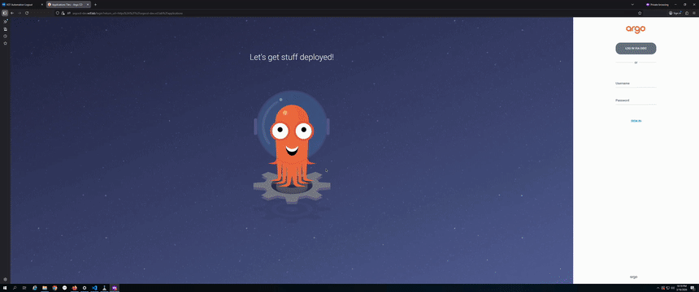
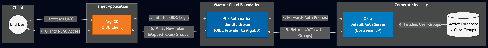
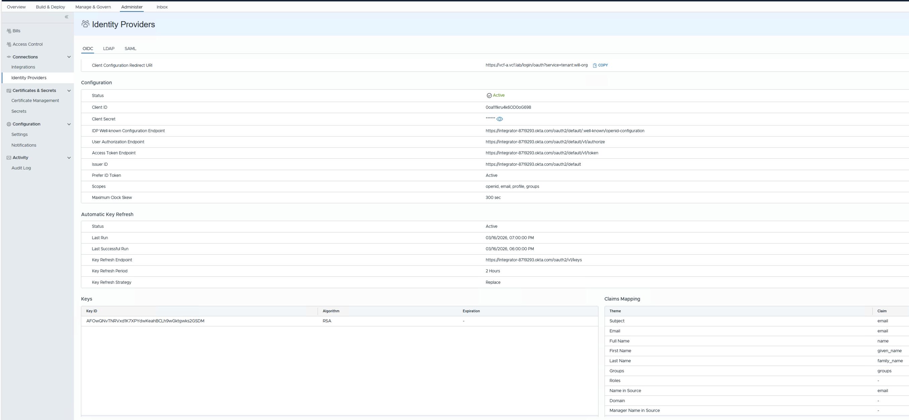
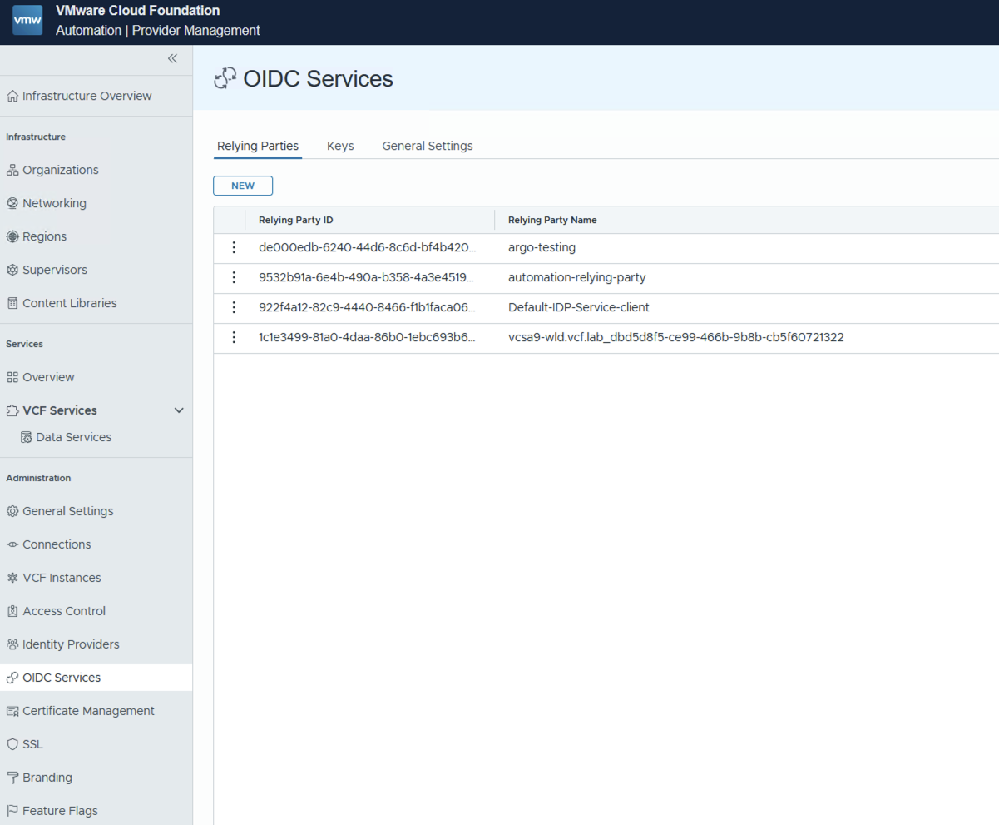
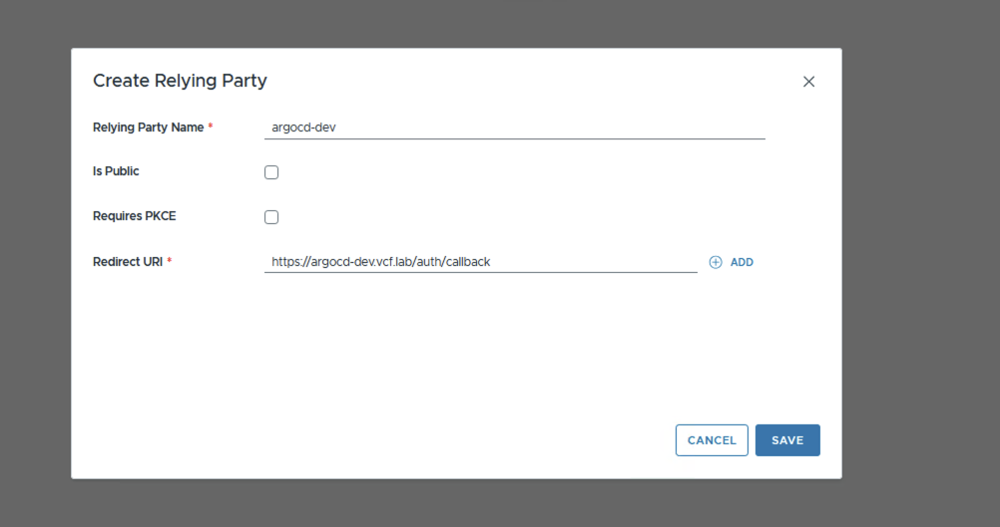
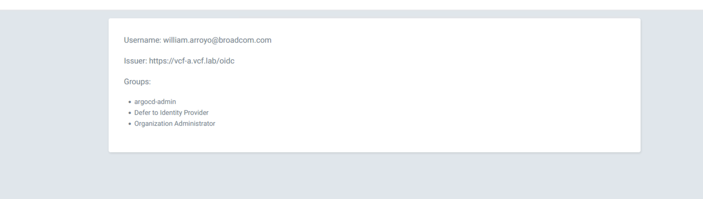

With support for [ArgoCD as a service](https://blogs.vmware.com/cloud-foundation/2025/07/11/gitops-for-vcf-broadcom-argo-cd-operator-now-available/) added to VCF I have been using it a lot more for automating my K8s environments. I also heavily use VCF Automation(VCFA) as my main cloud console for my VCF private cloud. I recently came across a feature in VCFA that is really useful, this is the ability to create "relying parties" this adds the ability to use VCFA and it's backing OIDC provider as an OIDC provider to other applications.

With these two features it immediately became clear that there is a good pairing here. I can have ArgoCD OIDC use VCFA as the provider making it so that users can seamlessly login into ArgoCD and as an administrator I can use common roles/groups for access. The rest of this post walks through setting up this integration.



## Architecture



## Implementation

### Setup OIDC for your Org

The first step in this process is making sure you have OIDC setup for your tenant Org. VCFA has the ability to do per tenant(Org) identity provider configuration. You can configure it with OIDC, SAML, or AD, once this is configured then logging into the tenant goes through your provider of choice and we have access to all of the claims, groups etc. that you setup in your upstream IDP. Ultimately we will use these groups in ArgoCD as well. I am not going to go into detail on how to set up the tenant OIDC in this post, but below is a screenshot of my configuration for Okta integration and here are the [official docs](https://techdocs.broadcom.com/us/en/vmware-cis/vcf/vcf-9-0-and-later/9-0/organization-management/managing-identity-providers-in-vcfa/configure-your-vcf-automation-organization-to-use-an-openid-identity-provider.html) to configure it.



### Setup the OIDC Service

This is the "relying party" I mentioned in the intro. It is basically a way to create OIDC clients that use VCFA as the provider. So in this case because Okta is my backing IDP for VCFA that means the relying party I create will also be able to use Okta for auth, but with far less configuration. Since it all goes through VCFA it will be treated as a single sign on as well so once I log into VCFA then I can seamlessly login to ArgoCD.

1.  Login to the the VCFA provider portal as an administrator and go to `OIDC services-> Relying Parties`
    



1.  Create a new relying party using the DNS name or IP address of the ArgoCD instance that will be deployed. Once you hit save it will generate a client secret, be sure to save that.
    
    
    

### Deploy ArgoCD

In this step, ArgoCD will be deployed as a service and using the new OIDC client it will be integrated into VCFA authentication.

1.  The below yaml can be used to deploy ArgoCD and also integrate OIDC with VCFA. Update the fields that have `##UPDATE THIS` next to them. This should use details from the previous steps.
    

```yaml
apiVersion: argocd-service.vsphere.vmware.com/v1alpha1
kind: ArgoCD
metadata:
  name: argocd-dev
  namespace: infra-ty3qk ##UPDATE THIS
spec:
  applicationSet:
    enabled: true
  enableLoadBalancer: true
  oidc:
    clientID: 4060b628-c297-49d3-ae0f-31cdcfb9ce86 ##UPDATE THIS
    clientSecret: mmSKfx8UZN6oYa31hGu95N+t+y1rbEih ##UPDATE THIS
    enabled: true
    insecure: true
    issuer: https://vcf-a.vcf.lab/oidc ##UPDATE THIS
    name: vcfa
    requestedIDTokenClaims:
      groups:
        essential: true
      preferred_username:
        essential: true
  rbac:
    policy: |
      g, "Organization Administrator", role:admin 
    policyMatchMode: glob
    scopes: '[groups,roles]'
  serverSideDiff: true
  url: https://argocd-dev.vcf.lab ##UPDATE THIS
  version: 3.0.19+vmware.1-vks.1
```

2.  Apply the yaml into a supervisor namespace. You should see the ArgoCD pods come up and become healthy.
    
3.  Add DNS. In this example I used `argocd-dev.vcf.lab` as my DNS auth callback in the relying party config, so ArgoCD needs to be available at that address. You can get the IP address for the ArgoCD Server by doing a `kubectl get svc -n <supervisor-ns>` and getting the external IP for the server.
    

There are a couple of things to note from the above YAML:

*   `issuer: https://vcf-a.vcf.lab/oidc` - this is your VCFA instance
    
*   `g, "Organization Administrator", role:admin` - this is what maps the role from VCFA to the ArgoCD admin role. You can make as many policy rules as you would like and also utilize groups from your upstream IDP. For example I also have a group called `argocd-admin` in my Okta. I could also add the policy `g, "argocd-admin", role:admin`
    
*   `scopes: '[groups,roles]'` - this tells ArgoCD to get both the groups and the roles from the token and use them for policy mapping.
    
*   `url: https://argocd-dev.vcf.lab` - this is a required setting, make sure this matches the callback url without the `auth/callback`
    

### Validation

Now that the integration is complete we can test the login and make sure that groups and roles are propagating correctly.

1.  Go to your ArgoCD server, in my case [https://argocd-dev.vcf.lab](https://argocd-dev.vcf.lab) . You will now see a "login with OIDC" button. If you are already logged into VCFA it will log you in as this user so be sure to logout if you want to use a different user.
    
2.  When it redirects to VCFA choose your org that you have setup the OIDC on
    
3.  Click "Login with OIDC" and it will take you through the normal process and redirect you back to ArgoCD.
    
4.  Validate your groups and username in ArgoCD. Go to User Info on the left side panel. This is what I see when logging in:
    
    
