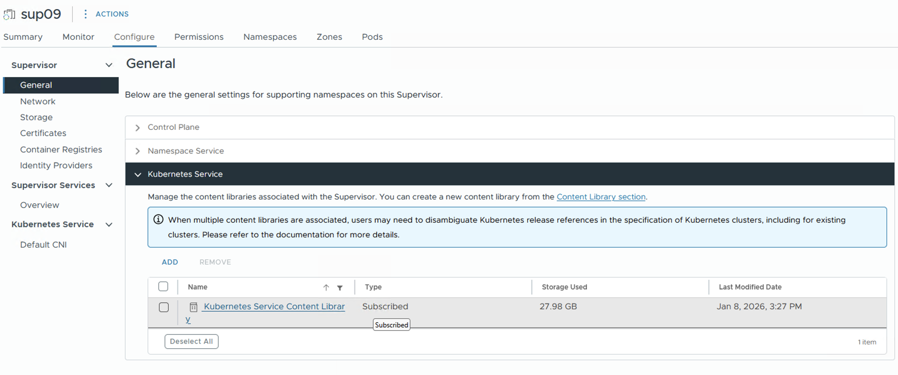
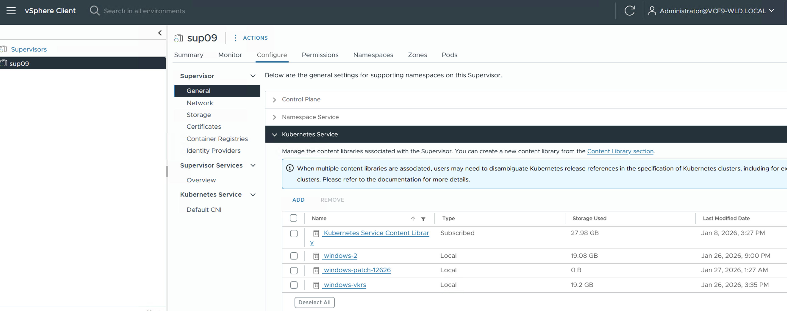

There have been numerous how-to guides over the past few years on building and deploying Windows clusters on the different Kubernetes distributions supported by VMware. This post aims to solidify the understanding of the current most up to date process of doing this on vSphere Kubernetes Service which is the definitive Kubernetes service for VMware. At the time of writing the latest [vSphere Kubernetes Release(VKR)](https://techdocs.broadcom.com/us/en/vmware-cis/vcf/vsphere-supervisor-services-and-standalone-components/latest/release-notes/vmware-vkr-release-notes.html) is `v1.34.1---vmware.1-vkr.4` so that is what this will be based on.

<div data-node-type="callout">
<div data-node-type="callout-emoji">💡</div>
<div data-node-type="callout-text"><strong>Note: this is based on VKS 3.5 using VKR 1.34.1. Be sure to check your versions and select the right image builder release based on your environment.</strong></div>
</div>

## Building the Image

Before deploying a cluster, we need to build a windows image. There is a process for this using the [VKS image builder](https://github.com/vmware/vks-image-builder) , this is what we will use in the next few steps to build the image.

### Pre-requisites

1.  Download the Windows ISO for windows server 2022. You can download the [evaluation](https://www.microsoft.com/en-us/evalcenter/evaluate-windows-server-2022) if needed.
    
2.  Download the Windows [VMware tools](https://support.broadcom.com/group/ecx/productdownloads?subfamily=VMware%20Tools&freeDownloads=true) ISO
    
3.  Upload the ISOs to a directory on a datastore in your vSphere environment that you will be running this build against. The below script can be used with [GOVC](https://github.com/vmware/govmomi/tree/main/govc) to upload the ISOs.
    

```bash
#!/bin/bash


set -e # Exit immediately if a command exits with a non-zero status


print_usage() {
    echo "Usage: $0 <LOCAL_ISO_PATH> <DATASTORE_NAME> <REMOTE_FOLDER>"
    echo ""
    echo "Arguments:"
    echo "  LOCAL_ISO_PATH   Path to the ISO file on your local machine."
    echo "  DATASTORE_NAME   Name of the vSphere Datastore (e.g., vsanDatastore)."
    echo "  REMOTE_FOLDER    Folder path inside the datastore (e.g., ISOs/Linux)."
    echo ""
    echo "Example:"
    echo "  $0 ./ubuntu.iso vsanDatastore ISOs/Ubuntu"
}

check_govc() {
    if ! command -v govc &> /dev/null; then
        echo "Error: 'govc' is not installed or not in your PATH."
        echo "Please install it from: https://github.com/vmware/govmomi/tree/master/govc"
        exit 1
    fi
}


if [ "$#" -ne 3 ]; then
    print_usage
    exit 1
fi

LOCAL_ISO="$1"
DATASTORE="$2"
REMOTE_FOLDER="$3"
FILENAME=$(basename "$LOCAL_ISO")
REMOTE_PATH="$REMOTE_FOLDER/$FILENAME"

check_govc

if [ ! -f "$LOCAL_ISO" ]; then
    echo "Error: Local file '$LOCAL_ISO' not found."
    exit 1
fi

if [ -z "$GOVC_URL" ]; then
    echo "Error: GOVC_URL environment variable is not set."
    echo "Please export GOVC_URL, GOVC_USERNAME, and GOVC_PASSWORD."
    exit 1
fi

echo "--- Starting Upload Process ---"
echo "File:      $FILENAME"
echo "Datastore: $DATASTORE"
echo "Folder:    $REMOTE_FOLDER"

if govc datastore.ls -ds="$DATASTORE" "$REMOTE_FOLDER" &> /dev/null; then
    echo "[OK] Remote folder '$REMOTE_FOLDER' exists."
else
    echo "[INFO] Remote folder '$REMOTE_FOLDER' does not exist. Creating it..."
    if govc datastore.mkdir -ds="$DATASTORE" "$REMOTE_FOLDER"; then
        echo "[OK] Folder created successfully."
    else
        echo "Error: Failed to create folder '$REMOTE_FOLDER' on datastore '$DATASTORE'."
        exit 1
    fi
fi

if govc datastore.ls -ds="$DATASTORE" "$REMOTE_PATH" &> /dev/null; then
    echo "Warning: File '$REMOTE_PATH' already exists on datastore '$DATASTORE'."
    read -p "Do you want to overwrite it? (y/N): " -n 1 -r
    echo
    if [[ ! $REPLY =~ ^[Yy]$ ]]; then
        echo "[INFO] Upload skipped by user."
        exit 0
    fi
    echo "[INFO] Overwriting existing file..."
fi

echo "[INFO] Uploading '$LOCAL_ISO'... (This may take a while)"
if govc datastore.upload -ds="$DATASTORE" "$LOCAL_ISO" "$REMOTE_PATH"; then
    echo ""
    echo "Success: Upload complete!"
    echo "Location: [$DATASTORE] $REMOTE_PATH"
else
    echo ""
    echo "Error: Upload failed."
    exit 1
fi
```

Example usage:

```bash
./uploadiso.sh ./VMware-tools-windows-12.5.0-23800621.iso cls-wld9-vsan01 isos
```

### Setting up the repo

1.  Clone the vks-image-builder repo
    

```bash
git clone https://github.com/vmware/vks-image-builder.git
cd vks-image-builder
```

2.  Create the windows answers file, the Upstream file can be found [here](https://raw.githubusercontent.com/kubernetes-sigs/image-builder/refs/heads/main/images/capi/packer/ova/windows/windows-2022-efi/autounattend.xml). I have added one below with a few updates. The updates have been marked with comments to highlight them. You will need to also update the areas that have an “Updates this” marker, this is really just updating the Windows password. If you are using the eval version you need to remove the product key from the file.
    

<div data-node-type="callout">
<div data-node-type="callout-emoji">💡</div>
<div data-node-type="callout-text"><strong>Note: In the below file there is an addition that I made that adds rules to the windows firewall. I saw an issue where the windows firewall believed I was coming from a public network. This is likely due to my specific network setup so you can leave it there or test without it. It is marked with a comment below.</strong></div>
</div>

```xml
<unattend xmlns="urn:schemas-microsoft-com:unattend" xmlns:wcm="http://schemas.microsoft.com/WMIConfig/2002/State">
    <settings pass="windowsPE">
        <component name="Microsoft-Windows-PnpCustomizationsWinPE" processorArchitecture="amd64" publicKeyToken="31bf3856ad364e35" language="neutral" versionScope="nonSxS">
            <DriverPaths>
                <PathAndCredentials wcm:action="add" wcm:keyValue="A">
                    <Path>a:\</Path>
                </PathAndCredentials>
            </DriverPaths>
        </component>
        <component name="Microsoft-Windows-Setup" processorArchitecture="amd64" publicKeyToken="31bf3856ad364e35" language="neutral" versionScope="nonSxS">
            <DiskConfiguration>
                <Disk wcm:action="add">
                    <CreatePartitions>
                        <CreatePartition wcm:action="add">
                            <Order>1</Order>
                            <Type>EFI</Type>
                            <Size>100</Size>
                        </CreatePartition>
                        <CreatePartition wcm:action="add">
                            <Order>2</Order>
                            <Type>MSR</Type>
                            <Size>16</Size>
                        </CreatePartition>
                        <CreatePartition wcm:action="add">
                            <Order>3</Order>
                            <Type>Primary</Type>
                            <Extend>true</Extend>
                        </CreatePartition>
                    </CreatePartitions>
                    <ModifyPartitions>
                        <ModifyPartition wcm:action="add">
                            <Order>1</Order>
                            <Format>FAT32</Format>
                            <Label>System</Label>
                            <PartitionID>1</PartitionID>
                        </ModifyPartition>
                        <ModifyPartition wcm:action="add">
                            <Order>2</Order>
                            <PartitionID>2</PartitionID>
                        </ModifyPartition>
                        <ModifyPartition wcm:action="add">
                            <Order>3</Order>
                            <Format>NTFS</Format>
                            <Label>Windows</Label>
                            <Letter>C</Letter>
                            <PartitionID>3</PartitionID>
                        </ModifyPartition>
                    </ModifyPartitions>
                    <WillWipeDisk>true</WillWipeDisk>
                    <DiskID>0</DiskID>
                </Disk>
            </DiskConfiguration>
            <ImageInstall>
                <OSImage>
                    <InstallTo>
                        <DiskID>0</DiskID>
                        <PartitionID>3</PartitionID>
                    </InstallTo>
                    <InstallFrom>
                        <MetaData wcm:action="add">
                            <Key>/IMAGE/NAME</Key>
                            <Value>Windows Server 2022 SERVERSTANDARDCORE</Value>
                        </MetaData>
                    </InstallFrom>
                </OSImage>
            </ImageInstall>
            <UserData>
                <AcceptEula>true</AcceptEula>
                <FullName>Administrator</FullName>
                <Organization>Organization</Organization>
                <ProductKey>
                    <Key>VDYBN-27WPP-V4HQT-9VMD4-VMK7H</Key>
                    <WillShowUI>OnError</WillShowUI>
                </ProductKey>
            </UserData>
            <EnableFirewall>true</EnableFirewall>
        </component>
        <component name="Microsoft-Windows-International-Core-WinPE" processorArchitecture="amd64" publicKeyToken="31bf3856ad364e35" language="neutral" versionScope="nonSxS">
            <SetupUILanguage>
                <UILanguage>en-US</UILanguage>
            </SetupUILanguage>
            <InputLocale>0409:00000409</InputLocale>
            <SystemLocale>en-US</SystemLocale>
            <UILanguage>en-US</UILanguage>
            <UILanguageFallback>en-US</UILanguageFallback>
            <UserLocale>en-US</UserLocale>
        </component>
    </settings>
    <settings pass="offlineServicing">
        <component name="Microsoft-Windows-LUA-Settings" processorArchitecture="amd64" publicKeyToken="31bf3856ad364e35" language="neutral" versionScope="nonSxS">
            <EnableLUA>false</EnableLUA>
        </component>
    </settings>
    <settings pass="generalize">
        <component name="Microsoft-Windows-Security-SPP" processorArchitecture="amd64" publicKeyToken="31bf3856ad364e35" language="neutral" versionScope="nonSxS">
            <SkipRearm>1</SkipRearm>
        </component>
    </settings>
    <settings pass="specialize">
        <component name="Microsoft-Windows-Deployment" processorArchitecture="amd64" publicKeyToken="31bf3856ad364e35" language="neutral" versionScope="nonSxS">
            <RunSynchronous>
                <RunSynchronousCommand wcm:action="add">
                    <WillReboot>Always</WillReboot>
                    <Path>%SystemRoot%\System32\reg.exe ADD "HKLM\System\CurrentControlSet\Control\TimeZoneInformation" /v RealTimeIsUniversal /d 1 /t REG_DWORD /f</Path>
                    <Order>1</Order>
                </RunSynchronousCommand>
                <RunSynchronousCommand wcm:action="add">
                    <WillReboot>Always</WillReboot>
                    <Path>e:\setup.exe /s /v "/qb REBOOT=R ADDLOCAL=ALL"</Path>
                    <Order>2</Order>
                </RunSynchronousCommand>
            </RunSynchronous>
        </component>
        <component name="Microsoft-Windows-International-Core" processorArchitecture="amd64" publicKeyToken="31bf3856ad364e35" language="neutral" versionScope="nonSxS">
            <InputLocale>0409:00000409</InputLocale>
            <SystemLocale>en-US</SystemLocale>
            <UILanguage>en-US</UILanguage>
            <UILanguageFallback>en-US</UILanguageFallback>
            <UserLocale>en-US</UserLocale>
        </component>
        <component name="Microsoft-Windows-Security-SPP-UX" processorArchitecture="amd64" publicKeyToken="31bf3856ad364e35" language="neutral" versionScope="nonSxS">
            <SkipAutoActivation>true</SkipAutoActivation>
        </component>
        <component name="Microsoft-Windows-SQMApi" processorArchitecture="amd64" publicKeyToken="31bf3856ad364e35" language="neutral" versionScope="nonSxS">
            <CEIPEnabled>0</CEIPEnabled>
        </component>
        <component name="Microsoft-Windows-Shell-Setup" processorArchitecture="amd64" publicKeyToken="31bf3856ad364e35" language="neutral" versionScope="nonSxS">
            <ComputerName />
            <ProductKey>VDYBN-27WPP-V4HQT-9VMD4-VMK7H</ProductKey>
        </component>
    </settings>
    <settings pass="oobeSystem">
        <component name="Microsoft-Windows-Shell-Setup" processorArchitecture="amd64" publicKeyToken="31bf3856ad364e35" language="neutral" versionScope="nonSxS">
            <AutoLogon>
                <Password>
                    <Value>VMware123!</Value> <!-- Update this -->
                    <PlainText>true</PlainText>
                </Password>
                <Enabled>true</Enabled>
                <Username>Administrator</Username>
            </AutoLogon>
            <FirstLogonCommands>
                <SynchronousCommand wcm:action="add">
                    <Order>1</Order>
                    <Description>Set Execution Policy 64 Bit</Description>
                    <CommandLine>cmd.exe /c powershell -Command "Set-ExecutionPolicy -ExecutionPolicy RemoteSigned -Force"</CommandLine>
                    <RequiresUserInput>true</RequiresUserInput>
                </SynchronousCommand>
                <SynchronousCommand wcm:action="add">
                    <Order>2</Order>
                    <Description>Set Execution Policy 32 Bit</Description>
                    <CommandLine>%SystemDrive%\Windows\SysWOW64\cmd.exe /c powershell -Command "Set-ExecutionPolicy -ExecutionPolicy RemoteSigned -Force"</CommandLine>
                    <RequiresUserInput>true</RequiresUserInput>
                </SynchronousCommand>
                <SynchronousCommand wcm:action="add">
                    <CommandLine>%SystemRoot%\System32\reg.exe ADD HKCU\SOFTWARE\Microsoft\Windows\CurrentVersion\Explorer\Advanced\ /v HideFileExt /t REG_DWORD /d 0 /f</CommandLine>
                    <Order>3</Order>
                    <Description>Show file extensions in Explorer</Description>
                </SynchronousCommand>
                <SynchronousCommand wcm:action="add">
                    <CommandLine>%SystemRoot%\System32\reg.exe ADD HKCU\Console /v QuickEdit /t REG_DWORD /d 1 /f</CommandLine>
                    <Order>4</Order>
                    <Description>Enable QuickEdit mode</Description>
                </SynchronousCommand>
                <SynchronousCommand wcm:action="add">
                    <CommandLine>%SystemRoot%\System32\reg.exe ADD HKCU\SOFTWARE\Microsoft\Windows\CurrentVersion\Explorer\Advanced\ /v Start_ShowRun /t REG_DWORD /d 1 /f</CommandLine>
                    <Order>5</Order>
                    <Description>Show Run command in Start Menu</Description>
                </SynchronousCommand>
                <SynchronousCommand wcm:action="add">
                    <CommandLine>%SystemRoot%\System32\reg.exe ADD HKCU\SOFTWARE\Microsoft\Windows\CurrentVersion\Explorer\Advanced\ /v StartMenuAdminTools /t REG_DWORD /d 1 /f</CommandLine>
                    <Order>6</Order>
                    <Description>Show Administrative Tools in Start Menu</Description>
                </SynchronousCommand>
                <SynchronousCommand wcm:action="add">
                    <CommandLine>%SystemRoot%\System32\reg.exe ADD HKLM\SYSTEM\CurrentControlSet\Control\Power\ /v HibernateFileSizePercent /t REG_DWORD /d 0 /f</CommandLine>
                    <Order>7</Order>
                    <Description>Zero Hibernation File</Description>
                </SynchronousCommand>
                <SynchronousCommand wcm:action="add">
                    <CommandLine>%SystemRoot%\System32\reg.exe ADD HKLM\SYSTEM\CurrentControlSet\Control\Power\ /v HibernateEnabled /t REG_DWORD /d 0 /f</CommandLine>
                    <Order>8</Order>
                    <Description>Disable Hibernation Mode</Description>
                </SynchronousCommand>
                <SynchronousCommand wcm:action="add">
                    <CommandLine>cmd.exe /c wmic useraccount where "name='Administrator'" set PasswordExpires=FALSE</CommandLine>
                    <Order>9</Order>
                    <Description>Disable password expiration for Administrator user</Description>
                </SynchronousCommand>
                <SynchronousCommand wcm:action="add">
                    <CommandLine>cmd.exe /c %SystemDrive%\Windows\System32\WindowsPowerShell\v1.0\powershell.exe -File a:\enable-winrm.ps1</CommandLine>
                    <Description>Enable WinRM</Description>
                    <Order>10</Order>
                </SynchronousCommand>
                <SynchronousCommand wcm:action="add">
                    <CommandLine>cmd.exe /c a:\disable-network-discovery.cmd</CommandLine>
                    <Description>Disable Network Discovery</Description>
                    <Order>11</Order>
                </SynchronousCommand>
                <SynchronousCommand wcm:action="add"> <!-- Customization for public network issue -->
                    <Order>12</Order>
                    <Description>Configure additional policy for public network</Description>
                    <CommandLine>cmd.exe /c powershell -NoProfile -ExecutionPolicy Bypass -Command "Set-NetFirewallRule -Name 'WINRM-HTTP-In-TCP-PUBLIC' -RemoteAddress Any; Set-Item -Path 'WSMan:\localhost\Service\Auth\Basic' -Value $true; Set-Item -Path 'WSMan:\localhost\Service\AllowUnencrypted' -Value $true"</CommandLine>
                    </SynchronousCommand>
            </FirstLogonCommands>
            <OOBE>
                <HideEULAPage>true</HideEULAPage>
                <HideLocalAccountScreen>true</HideLocalAccountScreen>
                <HideOEMRegistrationScreen>true</HideOEMRegistrationScreen>
                <HideOnlineAccountScreens>true</HideOnlineAccountScreens>
                <HideWirelessSetupInOOBE>true</HideWirelessSetupInOOBE>
                <NetworkLocation>Work</NetworkLocation>
                <ProtectYourPC>1</ProtectYourPC>
                <SkipMachineOOBE>true</SkipMachineOOBE>
                <SkipUserOOBE>true</SkipUserOOBE>
            </OOBE>
            <RegisteredOrganization>Organization</RegisteredOrganization>
            <RegisteredOwner>Owner</RegisteredOwner>
            <DisableAutoDaylightTimeSet>false</DisableAutoDaylightTimeSet>
            <TimeZone>Pacific Standard Time</TimeZone>
            <UserAccounts>
                <AdministratorPassword>
                    <Value>VMware123!</Value> <!-- Update this -->
                    <PlainText>true</PlainText>
                </AdministratorPassword>
           <LocalAccounts>
            <LocalAccount wcm:action="add">
                <Description>Administrator</Description>
                <DisplayName>Administrator</DisplayName>
                <Group>Administrators</Group>
                <Name>Administrator</Name>
            </LocalAccount>
            <LocalAccount wcm:action="add">
                <Password>
                    <Value>VMware123!</Value> <!-- Update this -->
                    <PlainText>true</PlainText>
                </Password>
                <Description>For log collection</Description>
                <DisplayName>Admin Account</DisplayName>
                <Name>WindowsAdmin</Name>
                <Group>Administrators</Group>
            </LocalAccount>
        </LocalAccounts>
            </UserAccounts>
        </component>
    </settings>
</unattend>
```

3.  Update the vsphere packer variables in `packer-variables/vsphere.j2` here is an example file, the fields that must be updates are marked with a comment `{# Update this #}`.
    

```json
{
    {# vCenter server IP or FQDN #}
    "vcenter_server":"vcsa9-wld.vcf.lab",    {# Update this #}
    {# vCenter username #}
    "username":"administrator@vcf9-wld.local", {# Update this #}
    {# vCenter user password #}
    "password":"VMware123!VMware123!", {# Update this #}
    {# Datacenter name where packer creates the VM for customization #}
    "datacenter":"wld9-DC", {# Update this #}
    {# Datastore name for the VM #}
    "datastore":"cls-wld9-vsan01", {# Update this #}
    {# [Optional] Folder name #}
    "folder":"",
    {# Cluster name where packer creates the VM for customization #}
    "cluster": "wls-wld9", {# Update this #}
    {# Packer VM network #}
    "network": "/wld9-DC/network/Virtual Private Clouds/image-builder-3/vm-public/vm-public", {# Update this #}
    {# To use insecure connection with vCenter  #}
    "insecure_connection": "true",
    {# TO create a clone of the Packer VM after customization#}
    "linked_clone": "true",
    {# To create a snapshot of the Packer VM after customization #}
    "create_snapshot": "true",
    {# To destroy Packer VM after Image Build is completed #}
    "destroy": "true"
}
```

4.  Update the windows specific packer vars. There are two files `packer-variables/windows/default-args-windows.j2` and `packer-variables/windows/vsphere-windows.j2` . Below are sample files with comments on where to update.
    

**vsphere-windows.j2 -** update the paths with the output from the iso upload script

```json
{
    {# [Optional] Windows only: Windows OS Image #}
    "os_iso_path": "[cls-wld9-vsan01] isos/en-us_windows_server_2022_x64_dvd_620d7eac.iso", {# Update this #}
    {# [Optional] Windows only: VMware Tools Image #}
    "vmtools_iso_path": "[cls-wld9-vsan01] isos/vmtools-windows.iso" {# Update this #}
}
```

**default-args-windows.j2 -** all that needs to be added here is the `windows_admin_password`

```json
{
  "additional_executables_destination_path": "C:\\ProgramData\\Temp",
  "additional_executables_list": "http://{{ host_ip }}:{{ artifacts_container_port }}/artifacts/{{ kubernetes_version }}/bin/windows/amd64/registry.exe,http://{{ host_ip }}:{{ artifacts_container_port }}/artifacts/{{ kubernetes_version }}/bin/windows/amd64/goss.exe",
  "additional_executables": "true",
  "additional_url_images": "false",
  "additional_url_images_list": "",
  "additional_prepull_images": "",
  "build_version": "{{ os_type }}-kube-{{ kubernetes_series }}-{{ ova_ts_suffix }}",
  "cloudbase_init_url": "http://{{ host_ip }}:{{ artifacts_container_port }}/artifacts/{{ kubernetes_version }}/bin/windows/amd64/CloudbaseInitSetup_x64.msi",
  "cloudbase_real_time_clock_utc": "true",
  "containerd_url": "http://{{ host_ip }}:{{ artifacts_container_port }}/artifacts/{{ kubernetes_version }}/bin/windows/amd64/cri-containerd.tar",
  "containerd_sha256_windows": "{{ containerd_sha256_windows_amd64 }}",
  "containerd_version": "{{ containerd }}",
  "convert_to_template": "true",
  "create_snapshot": "false",
  "disable_hypervisor": "false",
  "disk_size": "40960",
  "kubernetes_base_url": "http://{{ host_ip }}:{{ artifacts_container_port }}/artifacts/{{ kubernetes_version }}/bin/windows/amd64",
  "kubernetes_series": "{{ kubernetes_series }}",
  "kubernetes_semver": "{{ kubernetes_version }}",
  "kubernetes_typed_version": "{{ image_version }}",
  "load_additional_components": "true",
  "netbios_host_name_compatibility": "false",
  "nssm_url": "http://{{ host_ip }}:{{ artifacts_container_port }}/artifacts/{{ kubernetes_version }}/bin/windows/amd64/nssm.exe",
  "prepull": "false",
  "pause_image": "localhost:5000/vmware.io/pause:{{ pause }}",
  "runtime": "containerd",
  "template": "",
  "unattend_timezone": "Pacific Standard Time",
  "windows_updates_categories": "",
  "windows_updates_kbs": "",
  "wins_url": "",
  "custom_role": "true",
  "custom_role_names": "/image-builder/images/capi/image/ansible-windows",
  "ansible_user_vars": "ansible_winrm_read_timeout_sec=600 ansible_winrm_operation_timeout_sec=590 artifacts_container_url=http://{{ host_ip }}:{{ artifacts_container_port }} imageVersion={{ image_version|replace('-', '.') }} registry_store_archive_url=http://{{ host_ip }}:{{ artifacts_container_port }}/artifacts/{{ kubernetes_version }}/registries/{{ registry_store_path }}",
  "vmx_version": "21",
  "debug_tools": "false",
  "enable_auto_kubelet_service_restart": "false",
  "windows_admin_password": "VMware123!" {# Update this #}
}
```

## Running the Build

Now that all of the specific settings are in place we can run the build. This will output an OVA that can then be uploaded to a content lib and used in a VKS cluster.

1.  Start the artifacts container and run the build. The `TKR_SUFFIX` should match the suffix of your current linux VKR versions, this used when resolving the correct ova from the content lib. The `HOST_IP` should be your workstation IP that this command is running from. The `IMAGE_ARTIFACTS_PATH` is where you want the OVA to be created. The `AUTO_UNATTEND_ANSWER_FILE_PATH` is the path to your answers file.
    

```shell
 ##start the artifacts container

make run-artifacts-container ARTIFACTS_CONTAINER_PORT=8081
```

```shell
##run this from the vks-image-builder directory
make build-node-image OS_TARGET=windows-2022-efi TKR_SUFFIX=vkr.4 HOST_IP=10.0.0.180 IMAGE_ARTIFACTS_PATH=/home/will/windows-build-2/image ARTIFACTS_CONTAINER_PORT=8081 PACKER_HTTP_PORT=8082 AUTO_UNATTEND_ANSWER_FILE_PATH=/home/will/windows-build-2/vks-image-builder/windows_autounattend.xml
```

2.  Create a content lib and upload the OVA.
    

```shell
## update the datastore with your datastore as well as the path to the ova
govc library.create -ds "cls-wld9-vsan01" "windows-vkrs"
govc library.import windows-vkrs  ./image/ovas/windows-2022-amd64-v1.34.1---vmware.1-vkr.4.ova
```

## Setting up the content library

Before deploying a cluster, we need to associate our new content library with the supervisor. We can do this by going to the supervisor settings and under general adding another content library.

<div data-node-type="callout">
<div data-node-type="callout-emoji">💡</div>
<div data-node-type="callout-text"><strong>Note: when you do this there is a warning about multiple content libraries and needing to disambiguate between them. depending on how you build clusters you may need to add the correct annoations to specify the content library. This </strong><a target="_self" rel="noopener noreferrer nofollow" class="text-primary underline underline-offset-2 hover:text-primary/80 cursor-pointer" href="https://techdocs.broadcom.com/us/en/vmware-cis/vcf/vsphere-supervisor-services-and-standalone-components/latest/managing-vsphere-kubernetes-service/administering-kubernetes-releases-for-tkg-service-clusters/understanding-tkr-resolution/resolve-os-image-conflicts.html" style="pointer-events: none;"><strong>doc </strong></a><strong>has more details.</strong></div>
</div>



Verify that the image is showing up in the supervisor. Run this from the supervisor cluster context.

```bash
k get osimages -A | grep windows
vmi-4aacfc6e370e28a1e   v1.34.1+vmware.1           windows   2022         amd64   cvmi                13s
```

```bash
k get cclitem -A | grep windows
clitem-4aacfc6e370e28a1e   windows-2022-amd64-v1.34.1---vmware.1-vkr.4                                 cl-c80585866b93825a5       OVF    True    true     20615149892   true                100s
```

Take note of the content library ID for future use in cluster builds.

## Deploy a cluster

Now that we have verified the image is available we can deploy a cluster. There are a number of ways to do this but for the purpose of this post I am just going to share the yaml for the cluster and you can deploy it how you would like. The main thing to note below is the Windows node poo along with the annotation that tells it which content library to use.

```yaml
apiVersion: cluster.x-k8s.io/v1beta1
kind: Cluster
metadata:
  name: windows
  namespace: dev-ts6hw
spec:
  clusterNetwork:
    pods:
      cidrBlocks:
        - 192.168.156.0/20
    services:
      cidrBlocks:
        - 10.96.0.0/12
    serviceDomain: cluster.local
  topology:
    class: builtin-generic-v3.5.0
    classNamespace: vmware-system-vks-public
    version: v1.34.1---vmware.1-vkr.4
    variables:
      - name: kubernetes
        value:
          certificateRotation:
            enabled: true
            renewalDaysBeforeExpiry: 90
      - name: vmClass
        value: best-effort-small
      - name: storageClass
        value: vsan-default-storage-policy
    controlPlane:
      replicas: 1
      metadata:
        annotations:
          run.tanzu.vmware.com/resolve-os-image: os-name=photon, content-library=cl-a3b5e06b12f2737ca
    workers:
      machineDeployments:
        - class: node-pool
          name: windows-np-j72b
          replicas: 1
          variables:
            overrides:
              - name: vmClass
                value: best-effort-xsmall
        - class: node-pool
          name: windows-nodepool-l7rs
          replicas: 1
          metadata:
            annotations:
              run.tanzu.vmware.com/resolve-os-image: os-type=windows, content-library=cl-c80585866b93825a5
          variables:
            overrides:
              - name: vmClass
                value: best-effort-large
```

## Customizing images with Ansible

Sometimes it may be necessary to modify the image with custom scripts or binaries. This should be used with caution and also should only be used for things that cannot be done through a native K8s operator during runtime. Also this should not be used for anything that would require embedding passwords into the OVA. With those caveats out of the way let’s add some Ansible to modify the image build.

In this example we will add a simple Ansible task that runs a powershell script. This script does not perform any meaningful actions in this example but provides the details on how to set this up so that you can use a similar process for anything you need to install.

1.  Add a new file to the `vks-image-builder/ansible-windows/tasks` folder. This `ansible-windows` folder is the Ansible role that executes by default during the build process.
    

```bash
touch vks-image-builder/ansible-windows/tasks/exec-pwsh.yml
```

2.  Add the contents of the Ansible task to the new file .
    

```yaml
- name: Execute custom BYOI script
  ansible.builtin.script: scripts/helloworld.ps1
```

2.  Add the powershell script to the files in the Ansible role.
    

```bash
touch vks-image-builder/ansible-windows/files/scripts/helloworld.ps1
```

3.  Add the contents of the script to the file.
    

```powershell
Write-Output "Hello, World!"
```

4.  Update the `main.yml` to include your new tasks
    

```yaml

- import_tasks: exec-pwsh.yml
```

## Updating cluster nodes for patching

Since these are images that you maintain, you may need to update an image with a one off patch etc. This may also be the case for images that don’t have a new k8s version to go along with it. In the case of patching a with new K8s version it’s pretty simple, you build a new image with the new K8s version and then update the K8s version on your cluster definition. But what about the case where there are no changes upstream from Broadcom, that’s what we will cover here. In this case we want to patch or change something on the image and want to roll that out to our clusters without changing anything else.

To do this, we need to understand.a bit about how an OVA in a content library is resolved by VKS.

1.  The VKR version selected in the cluster definition. This looks something like `v1.34.1---vmware.1-vkr.4`, we can see that this is version 1.34.1 of K8s, also that it’s a patch release of `vmware.1-vkr.4` this suffix is used during the image resolution process.
    
2.  The OS , this is set on the node pools usually Photon, Ubuntu, or Windows.
    
3.  The OS version, for Ubuntu we might see 22.04, Windows we would see 2022
    
4.  The content library setting
    

When these are combined VKS looks at the available OS images that match the right VKR version and OS settings and then pulls the right ova from the content library to create the node.

Now the challenge we run into is that if we just update our patch suffix to something like `vkr.5` and then when we build a cluster the Windows nodes would be resolved but if our Linux nodes don’t also have a `vkr.5` patch release then it won’t find the right images. We also need to make sure our content library item is following the standard naming convention so that it is picked up bu VKS, the name geenrated by the image builder creates this in the proper format(`windows-2022-amd64-v1.34.1---vmware.1-vkr.4`). Since there is already an OVA in the content library named that we can’t upload the new one unless we want to overwrite it. Overwriting the image is a perfectly accetable way to roll out a new patch however I would prefer to have some more control over the process. So we need another way to manage this. This is where the content library setting comes in, we can create a new content library for our patch and upload the new OVA then selectively roll out the new node image.

1.  Create a new content library for the patch and upload the new image.
    

```bash
govc library.create -ds "cls-wld9-vsan01" "windows-patch-12626"
govc library.import windows-patch-12626  ./image/ovas/windows-2022-amd64-v1.34.1---vmware.1-vkr.4.ova
```

2.  Update supervisor config to add the new content library
    



3.  Update your cluster yaml to use the new content library ID.
    

```bash
k get cclitem -A | grep -i windows
```

```yaml
 run.tanzu.vmware.com/resolve-os-image: os-type=windows, content-library=cl-1c5b6ba4a0e41aa16
```
